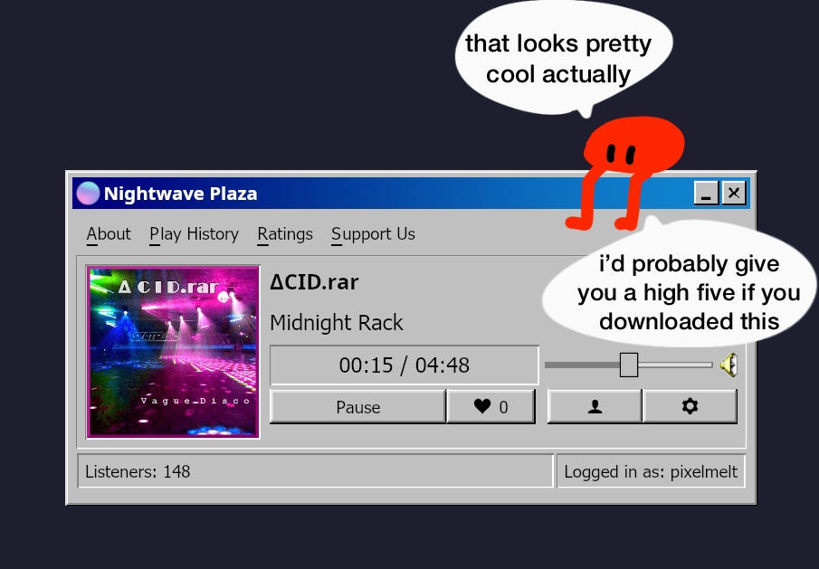

# Nightwave Plaza Native

A native desktop client for [Nightwave Plaza](https://plaza.one), the internet vaporwave radio station

Built in Rust with [iced](https://iced.rs).



## Features

- Live streaming of the Nightwave Plaza radio feed.
- Discord presense
- Now playing, album artwork, artist, title, and track progress.
- OS media controls, integrates with system media keys and now-playing widgets via [souvlaki](https://crates.io/crates/souvlaki).
- Accounts, log in
- Sleep timer and adjustable volume.
- Last.fm scrobbling (configure in Settings).

## Installation

### Windows

Download `nightwave-plaza.exe` from the [latest release](https://github.com/PixelMelt/nightwave-plaza-native/releases/latest) and run it.

Windows may show a SmartScreen warning because the binary is unsigned. Click More info > Run anyway.

### Linux

Run the install script, which builds the binary and registers it as a desktop app:

```sh
git clone https://github.com/PixelMelt/nightwave-plaza-native
cd nightwave-plaza-native
./dist/install.sh
```

install.sh does three things:

- Builds + installs the binary via `cargo install --path .` (into `~/.cargo/bin`, which is on your PATH).
- Installs the icon into `~/.local/share/icons/hicolor/256x256/apps/` so launchers can find it.
- Installs the desktop entry (`dist/nightwave-plaza.desktop`) into `~/.local/share/applications/` so "Nightwave Plaza" shows up in your app menu, then refreshes the desktop/icon caches.

## Building & Running

```sh
cargo run --release
```

To build a distributable binary:

```sh
cargo build --release
# binary at target/release/nightwave-plaza
```
