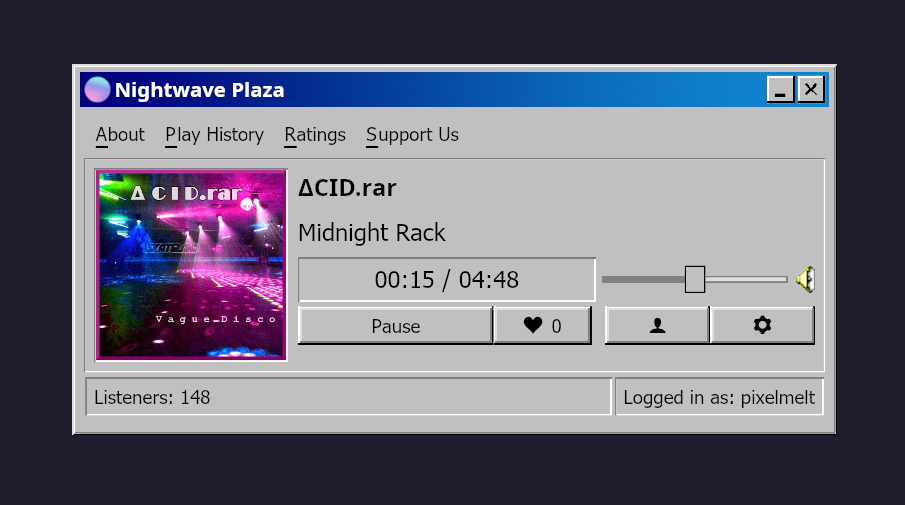

# Nightwave Plaza Native

A native desktop client for [Nightwave Plaza](https://plaza.one), the internet vaporwave radio station

Built in Rust with [iced](https://iced.rs).



## Features

- Live streaming of the Nightwave Plaza radio feed.
- Now playing, album artwork, artist, title, and track progress.
- OS media controls, integrates with system media keys and now-playing widgets via [souvlaki](https://crates.io/crates/souvlaki).
- Accounts, log in
- Reactions & favorites,
- Sleep timer and adjustable volume.
- Spacebar play/pause when the player window is focused.

## Building & Running

```sh
cargo run --release
```

To build a distributable binary:

```sh
cargo build --release
# binary at target/release/nightwave-plaza
```

Fonts, icons, and images are embedded into the binary at compile time (from `src/assets/`), so the executable is self-contained.

## Configuration

- Login session is stored at the platform config directory under `nightwave-plaza/session.json`

## Endpoints

The client talks to the official Nightwave Plaza services:

- Stream: `https://radio.plaza.one/mp3`
- API: `https://api.plaza.one`

## Acknowledgements

All music, artwork, and station data belong to [Nightwave Plaza](https://plaza.one) and the respective artists. This is an unofficial third-party client.
